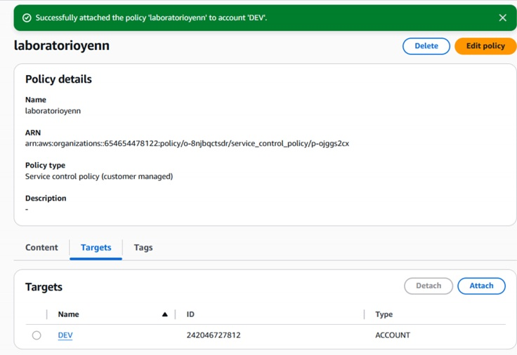
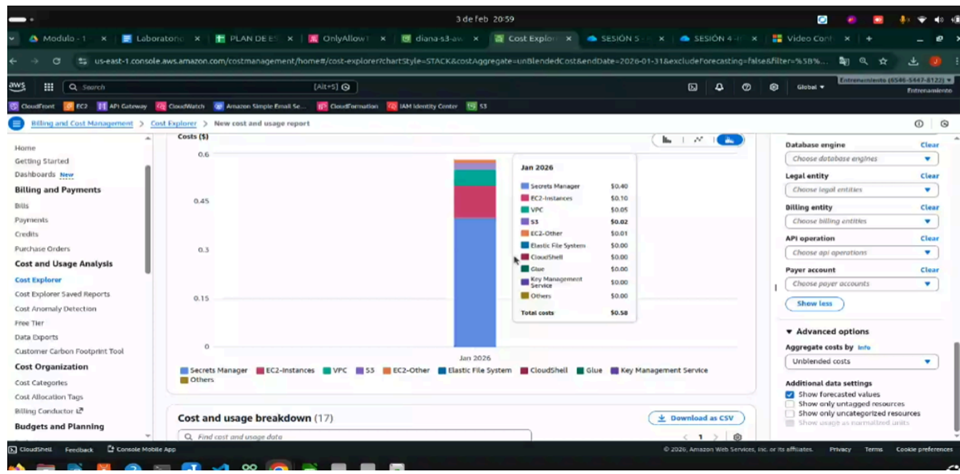
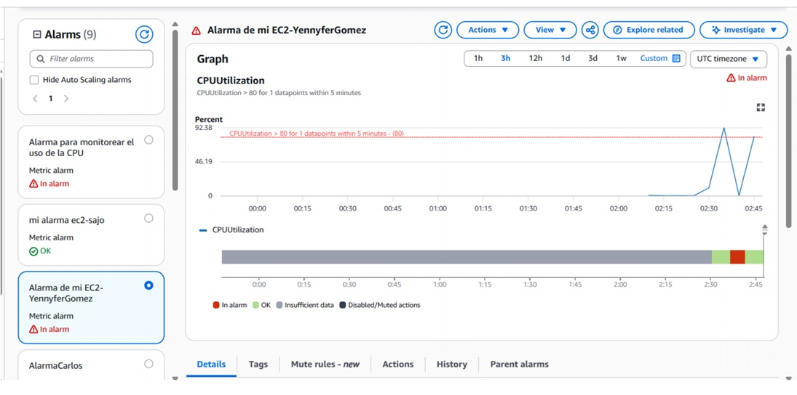

# AWS Governance, Security & FinOps 🛡️💰

Este repositorio documenta la implementación de estrategias de control, auditoría y optimización de costos en AWS. El objetivo es garantizar que la infraestructura sea segura, monitoreada y financieramente eficiente.

---

## 🔐 1. Gobernanza: Service Control Policies (SCP)
En este laboratorio se trabajó con **AWS Organizations** para gestionar múltiples cuentas de forma centralizada.

* **Objetivo:** Establecer barreras de seguridad (guardrails) que las cuentas de los miembros no puedan saltarse, incluso con permisos de Administrador.
* **Habilidades demostradas:** * Configuración de Unidades Organizativas (OU).
    * Creación de SCPs para restringir el acceso a regiones no autorizadas y servicios de alto costo.
    * Validación de la herencia de políticas.

> **Evidencia de implementación:**
> 

---

## 📈 2. FinOps: Gestión de Costos y Presupuestos
Análisis proactivo del gasto en la nube para evitar sorpresas en la facturación y optimizar el uso de recursos.

* **Herramientas utilizadas:** AWS Cost Explorer, AWS Pricing Calculator y AWS Budgets.
* **Habilidades demostradas:** * Uso de **Tags (Etiquetas)** para la asignación de costos por proyecto o departamento.
    * Creación de proyecciones de gasto basadas en el uso histórico.
    * Estimación de costos para nuevas arquitecturas antes del despliegue.

> **Evidencia de implementación:**
> 

---

## 🕵️ 3. Monitoreo y Auditoría: CloudWatch & CloudTrail
Implementación de observabilidad completa para entender qué sucede en la infraestructura y quién realiza los cambios.

* **CloudTrail:** Registro de todas las llamadas a la API de AWS para auditoría de seguridad y cumplimiento.
* **CloudWatch:** Monitoreo de métricas de rendimiento y configuración de alarmas automáticas (ej. alertas de CPU o de facturación).
* **Habilidades demostradas:** * Configuración de Trails (rastros) globales.
    * Creación de Dashboards de monitoreo.
    * Configuración de notificaciones mediante SNS ante eventos críticos.

> **Evidencia de implementación:**
> 

---

## 🛠️ Tecnologías Utilizadas
* **Seguridad:** AWS Organizations, IAM, SCP.
* **Observabilidad:** Amazon CloudWatch, AWS CloudTrail.
* **Gestión Financiera:** AWS Cost Explorer, Budgets, Pricing Calculator.

---
*Este proyecto es parte de mi formación académica y mi portafolio profesional como Cloud Engineer.*
